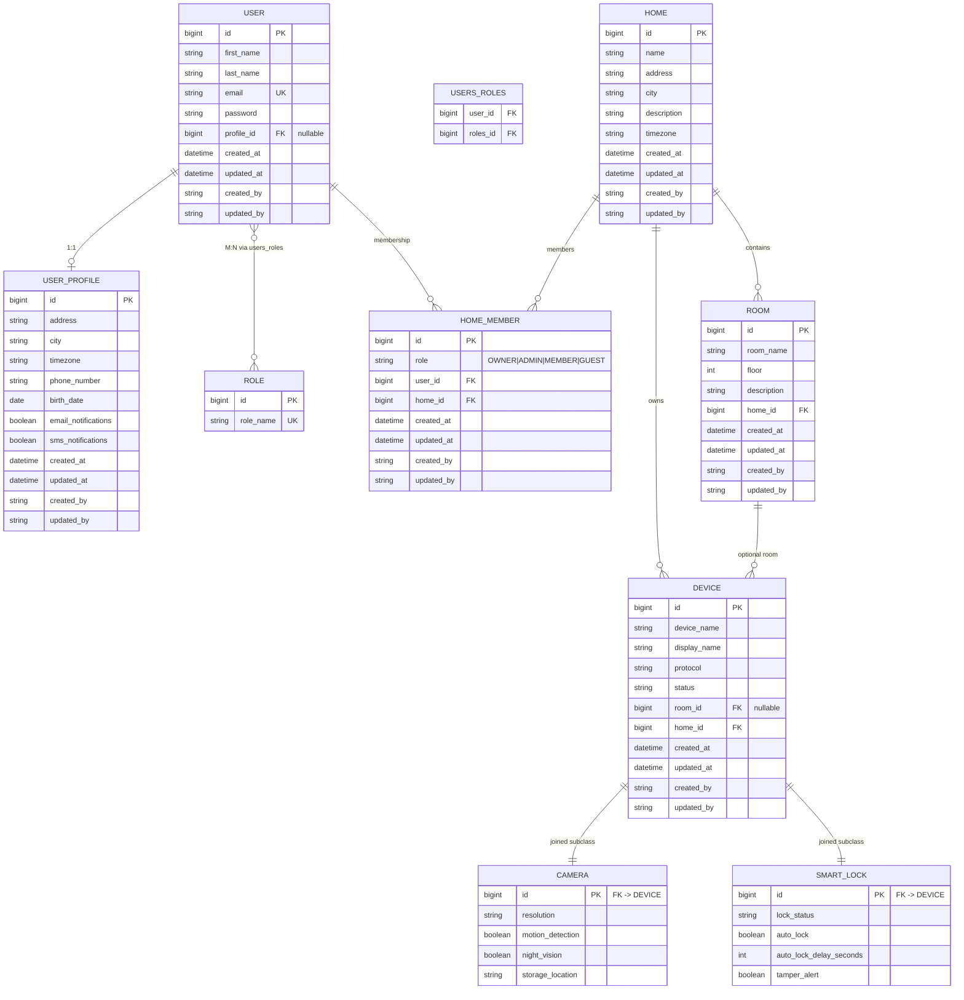
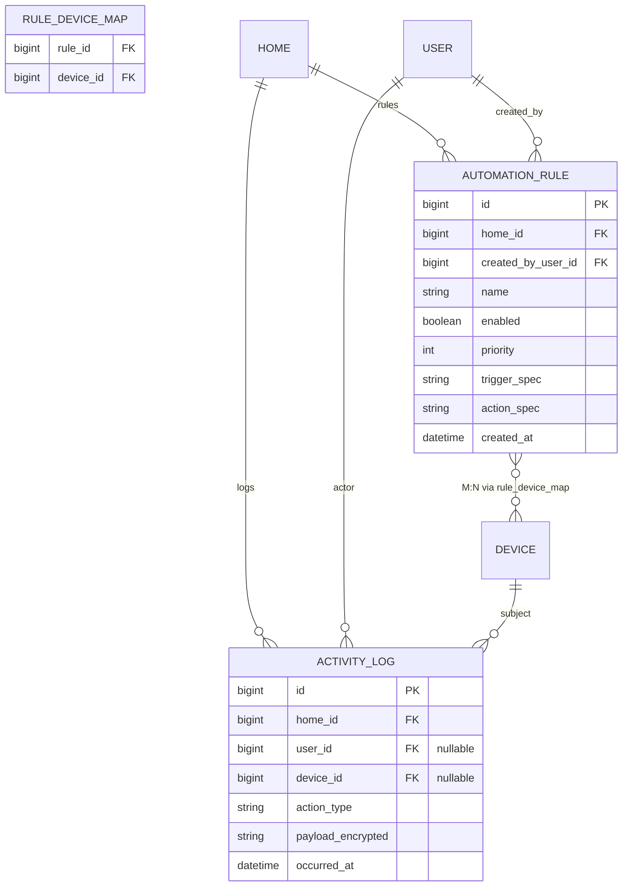

# SecureHome — Entity-Relationship Diagram

This document matches the **deployed JPA data model** in the SecureHome codebase. Optional entities at the end reflect the **report / full product** roadmap (not yet implemented as `@Entity` classes).

---

## 1. Implemented schema (current deliverable)

**Notes**

- **DEVICE** uses JPA `JOINED` inheritance: base row in `devices`; `cameras` and `locks` rows share the same primary key as `devices.id`.
- **HomeMember.role** is per-home membership (Owner/Admin/Member/Guest). **Role** on `USER` is global app role (e.g. `ROLE_USER`, `ROLE_ADMIN`) via `users_roles`.
- Audit columns come from `BaseEntity` (`created_at`, `updated_at`, `created_by`, `updated_by`) on all entities that extend it except **Role** (no audit in code).

---

## 2. Report-aligned extensions (full product — optional)

Add when you implement activity logging, automation, and optional token storage:

---

## 3. How to use in your report

1. Copy section **1** into [Mermaid Live Editor](https://mermaid.live) or a Markdown renderer that supports Mermaid (GitHub, many IDEs).
2. Export as PNG/SVG for Word: **Figure — ER Diagram: SecureHome Local Database Schema**.
3. In the caption, state: *“Solid model reflects the current Spring Data JPA schema; subsection 2 depicts planned tables for activity logging and automation described in the requirements document.”*

---

## 4. Cardinalities (text summary)

| Relationship | Cardinality |
|-------------|-------------|
| USER — USER_PROFILE | 1 : 0..1 |
| USER — ROLE | M : N (`users_roles`) |
| USER — HOME_MEMBER | 1 : N |
| HOME — HOME_MEMBER | 1 : N |
| HOME — ROOM | 1 : N |
| HOME — DEVICE | 1 : N |
| ROOM — DEVICE | 1 : N (nullable `room_id`) |
| DEVICE — CAMERA | 1 : 0..1 (subtype) |
| DEVICE — SMART_LOCK | 1 : 0..1 (subtype) |
